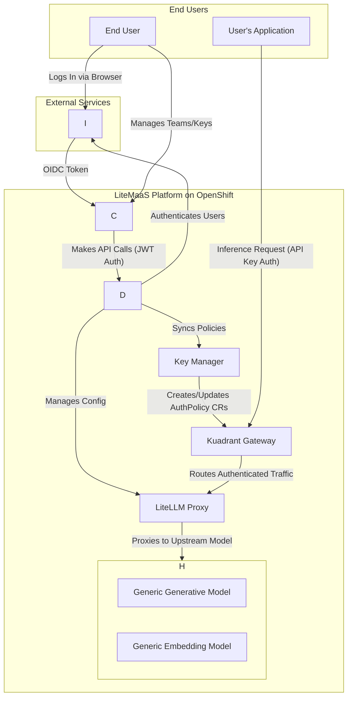

Here’s your content fully converted to **Markdown** formatting for easier readability and portability (e.g., into GitHub, docs, or a README).

---

# LiteMaaS: An Architectural Blueprint for Enterprise Model Management

## Part 1: Analysis of the Key Manager Deployment Architecture on OpenShift

This section provides a comprehensive analysis of the key-manager component, designed for deployment on OpenShift with the Kuadrant API Gateway. The analysis deconstructs the presumed Kubernetes manifests within the `deployment/kuadrant-openshift/key-manager/` directory, detailing the component's architecture, strategic purpose, and operational procedures. This analysis forms the basis for the operational documentation provided in Appendix A.

---

### 1.1. Component Overview and Strategic Role

The **Key Manager** service is a critical middleware component within the LiteMaaS architecture, functioning as an intelligent controller that bridges the LiteMaaS application's business logic with the underlying network infrastructure managed by the Kuadrant API Gateway.

* **Primary Responsibility:** Translate high-level application state (e.g., new API key creation or budget updates) into low-level, declarative **security policies** enforced by Kuadrant.
* **Integration Model:** Acts as a Kubernetes **operator/controller** that dynamically manages **AuthPolicy CRs** based on LiteMaaS backend events.
* **Benefits:**

    * Decouples application from API gateway specifics.
    * Enables clean replacement of gateway technologies (Kuadrant → another solution).
    * Encapsulates integration logic (e.g., `"authorize key X for model Y"`).

This follows patterns seen in projects like **models-aas**, where a dedicated layer (3scale) secures model endpoints on OpenShift. The Key Manager extends this in a **cloud-native, GitOps-friendly** manner.

---

### 1.2. Prerequisites for Deployment

Before deploying the Key Manager service, ensure:

* **OpenShift Cluster:** OCP v4.12+ with appropriate permissions (`cluster-admin` for operators).
* **Kuadrant Operator:** Installed and configured with a `ManagedZone`.
* **LiteLLM Proxy Service:** Deployed and running; target for Kuadrant Gateway.
* **Container Registry Access:** Cluster must access the image registry; configure pull secrets if private.
* **CLI Tooling:** `oc` or `kubectl` installed and configured with valid cluster credentials.

---

### 1.3. Resource Manifest Deep Dive

Key manifests (likely Kustomize-managed):

#### 1.3.1. `configmap.yaml`

* **Purpose:** Externalize runtime configuration.
* **Fields:**

    * `LITELLM_API_URL`: LiteLLM Proxy management API.
    * `KUADRANT_NAMESPACE`: Target namespace for `AuthPolicy` CRs.
    * `LOG_LEVEL`: Logging verbosity.
    * `API_PORT`: API server port.

#### 1.3.2. `deployment.yaml`

* **Purpose:** Manages lifecycle, scaling, and updates.
* **Fields:** replicas, selector, image, ports, `envFrom` ConfigMap, `serviceAccountName` (with RBAC perms).

#### 1.3.3. `service.yaml`

* **Purpose:** Provides stable DNS endpoint for Key Manager.
* **Fields:** selector, ports.

#### 1.3.4. `route.yaml` (OpenShift-specific)

* **Purpose:** Optional external access (e.g., for health checks/admin).
* **Fields:** `to.kind`, `to.name`, `port.targetPort`, `tls.termination`.

#### 1.3.5. `role.yaml` and `rolebinding.yaml`

* **Purpose:** RBAC permissions for managing `AuthPolicy`.
* **Key Role Rules:**

    * `apiGroups`: `kuadrant.io`
    * `resources`: `authpolicies`
    * `verbs`: get, list, watch, create, update, patch, delete
* **RoleBinding:** Binds ServiceAccount → Role.

---

### 1.4. Deployment and Verification Procedures

#### 1.4.1. Deployment Steps

```bash
# Log in
oc login --token=<your-token> --server=<your-api-server>

# Select namespace/project
oc project litemaas-infra

# Apply manifests with Kustomize
oc apply -k .

# Or apply individually
oc apply -f configmap.yaml -f role.yaml -f ...
```

#### 1.4.2. Verification Steps

```bash
# Check pod status
oc get pods -l app=key-manager

# Inspect logs
oc logs deployment/key-manager

# Verify Kuadrant integration
oc get authpolicy -n <kuadrant-namespace>
oc describe authpolicy <policy-name>
```

* **Negative Test:** Missing API key → `401/403` expected.
* **Positive Test:** Valid API key → `200 OK` + valid response.

---

## Part 2: Strategic Enhancement of the LiteMaaS API

### 2.1. Current State Assessment and Gap Analysis

The initial API (13 endpoints) is a strong MVP but underuses LiteLLM Proxy features.

**Key Gaps:**

* **Model Management:** Only read-only; should support CRUD.
* **Key Management:** No granular controls (block/regenerate/spend limits).
* **Budget Management:** Read-only; should enable proactive budget caps.
* **User/Team Hierarchy:** Missing roles/permissions model.
* **Security/Config:** Lacks IP allow-listing, secure credentials.

**Strategic Goal:** LiteMaaS API should **orchestrate** LiteLLM + Key Manager → simplify complex workflows.

---

### 2.2. Proposed LiteMaaS API Specification v2.0

#### 2.2.1. Design Principles

* **User-Centric Abstraction**
* **Stateless/RESTful**
* **Dual-Auth Model:** OIDC (management plane) + API keys (data plane)
* **Multi-Tenant Aware**

#### 2.2.2. API Table

| Endpoint                               | Description                    | Key Fields                        | Rationale/Orchestration                    |
| -------------------------------------- | ------------------------------ | --------------------------------- | ------------------------------------------ |
| `GET /v2/users/me`                     | Retrieves current user profile | `user_id`, `email`, `teams`       | Context for UI; OIDC auth                  |
| `POST /v2/teams`                       | Create new team                | `team_name`, `description`        | Establishes tenant scope                   |
| `GET /v2/teams/{id}`                   | Retrieve team details          | `members`, `keys`                 | Admin dashboard                            |
| `POST /v2/teams/{id}/members`          | Add team member                | `user_email`, `role`              | RBAC-managed membership                    |
| `DELETE /v2/teams/{id}/members/{user}` | Remove member                  | –                                 | Manage access lifecycle                    |
| `POST /v2/teams/{id}/keys`             | Create scoped API key          | `alias`, `models[]`, `budget_usd` | Orchestrates LiteLLM + Kuadrant AuthPolicy |
| `GET /v2/teams/{id}/keys`              | List team keys                 | `key_id`, `budget`, `spend`       | Monitoring and reporting                   |
| `PATCH /v2/keys/{id}`                  | Update key props               | `budget`, `status`                | Dynamically enforce limits                 |
| `DELETE /v2/keys/{id}`                 | Delete key                     | –                                 | Removes LiteLLM + Kuadrant policy          |
| `GET /v2/models`                       | List available models          | `id`, `description`, `pricing`    | User-facing catalog                        |
| `POST /v2/admin/models`                | Add new model                  | `model_name`, `params`            | Operator-managed                           |
| `PATCH /v2/admin/models/{id}`          | Update model config            | `params`                          | Rotate creds, URLs                         |
| `GET /v2/teams/{id}/activity`          | Usage + cost reporting         | `start/end`, `group_by`           | Billing + governance                       |

---

### 2.3. Authentication & Authorization Strategy

* **Management Plane:** OIDC/JWT for `/v2/...` (validated by backend).
* **Data Plane:** API keys for inference requests (enforced by Kuadrant).
* **Benefit:** Clean separation of concerns; scalable + revocable auth.

---

## Part 3: Proposed Technical Roadmap for LiteMaaS

### 3.1. Phase 1: Foundational Implementation (MVP)

* **Goal:** Secure functional baseline (single user).
* Features: OIDC auth, core backend, basic key mgmt, Key Manager integration, minimal reporting.

### 3.2. Phase 2: Enterprise Feature Enablement (Multi-Tenancy)

* **Goal:** Enterprise-ready, multi-tenant service.
* Features: Full team mgmt, team-scoped budgets, advanced reporting, admin model mgmt.

### 3.3. Phase 3: Ecosystem Integration & Scalability

* **Goal:** Production-scale readiness.
* Features: Observability stack, advanced security (IP allow-lists), HA model serving, UI.

---

## Part 4: Updated System Architecture Diagrams

### 4.1. Component Interaction Diagram



### 4.2. Sequence Diagram

```mermaid
sequenceDiagram
    participant App as User's Application
    participant KG as Kuadrant Gateway
    participant KM as Key Manager (Controller)
    participant LP as LiteLLM Proxy
    participant MSR as Model Serving Runtime

    Note over App, MSR: Flow for a secured inference request

    App->>+KG: POST /v1/chat/completions <br> Header: X-API-Key: [user_key]

    Note over KG: Kuadrant evaluates AuthPolicy
    KG->>KG: 1. Find matching AuthPolicy
    KG->>KG: 2. Validate X-API-Key

    alt Authorized
        KG->>+LP: Forward request
        LP->>+MSR: Forward to model server
        MSR-->>-LP: Model Response
        LP-->>-KG: Forward Response
        KG-->>-App: 200 OK + Response
        Note right of LP: Async usage + cost logging
    else Unauthorized
        KG-->>-App: 401/403 Forbidden
    end
```

---

## Part 5: Appendix

### Appendix A: Draft README.md for Key Manager Deployment

#### 1. Overview

The Key Manager is a middleware component that translates LiteMaaS key policies into **Kuadrant AuthPolicies**.

#### 2. Prerequisites

* OpenShift 4.12+
* Admin CLI access (`oc`/`kubectl`)
* Kuadrant Operator + ManagedZone
* LiteLLM Proxy instance
* Registry access for container image

#### 3. Resource Manifests

* `configmap.yaml`: External configuration
* `deployment.yaml`: Pod lifecycle management
* `service.yaml`: ClusterIP endpoint
* `role.yaml`: RBAC Role
* `serviceaccount.yaml`: Service Account
* `rolebinding.yaml`: RoleBinding

#### 4. Deployment

```bash
oc login --token=<your-token> --server=<your-api-server>
oc project litemaas-infra
oc apply -k .
# Or
for f in *.yaml; do oc apply -f $f; done
```

#### 5. Verification

```bash
# Pods running?
oc get pods -l app=key-manager

# Logs?
oc logs deployment/key-manager

# AuthPolicy created?
oc get authpolicy -n <kuadrant-namespace>
```

* Without API key → `401/403` expected
* With API key → `200 OK` response

---

Do you want me to **split this into multiple `.md` files** (e.g., `README.md`, `API_SPEC.md`, `ROADMAP.md`) for easier GitHub repo organization, or keep it as a single long document?


# API Improvement Ideas and Next Steps

This document outlines potential enhancements for the MaaS API based on the current repository and the LiteLLM integration approach.

## Current Strengths
- Centralized API key management with Kubernetes Secrets
- Token-based rate limiting through Kuadrant
- OpenAI-compatible model endpoints generated by KServe

## Areas for Improvement

### 1. User Management
- Synchronize users with an external identity provider (e.g., Keycloak)
- Support team membership and role-based access control
- Expose CRUD endpoints for basic user info and tier assignments

### 2. Model Management
- Provide `/v1/models` backed by live HTTPRoute discovery instead of static data
- Add endpoints to retrieve model metadata (capabilities, pricing)
- Enable administrators to register or retire models via API

### 3. Key Management
- Allow administrators to rotate or disable keys without deletion
- Implement self-service key creation with optional approval workflows
- Add pagination and filtering for listing existing keys

### 4. Activity Reporting
- Expose usage metrics per user and per model
- Include token counts and cost estimates in responses
- Offer exportable audit logs for compliance

### 5. LiteLLM Alignment
- Mirror LiteLLM's API surface for compatibility with existing clients
- Add model and team management endpoints similar to the LiteLLM reference
- Explore budgeting features once core management APIs are stable

## Next Steps
1. Implement dynamic model discovery for `/v1/models`
2. Add user and team synchronization endpoints
3. Extend key manager with rotation and reporting features
4. Prototype LiteLLM-compatible management APIs

