# MaaS (Models as a Service) Platform Architecture

## Overview

The MaaS platform provides secure, multi-tenant access to Large Language Models (LLMs) through a comprehensive API management system built on Kubernetes and Kuadrant. The architecture implements token-based rate limiting, API key management, and fine-grained access control to enable scalable model serving with cost control.

## Core Architecture Components

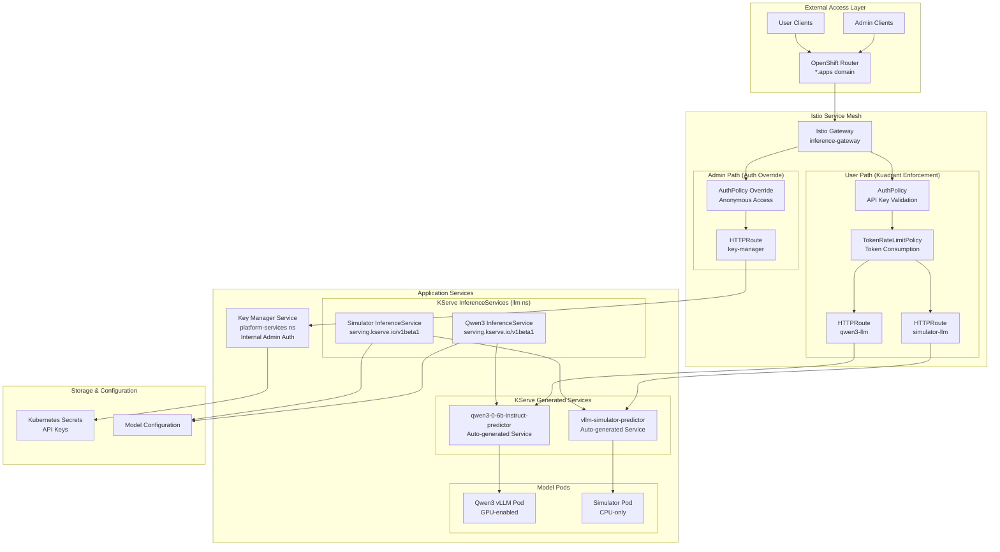

## KServe Integration Architecture

The MaaS platform uses KServe as the model serving foundation, providing standardized InferenceService deployments that integrate seamlessly with Kuadrant's authentication and rate limiting.

### KServe Components

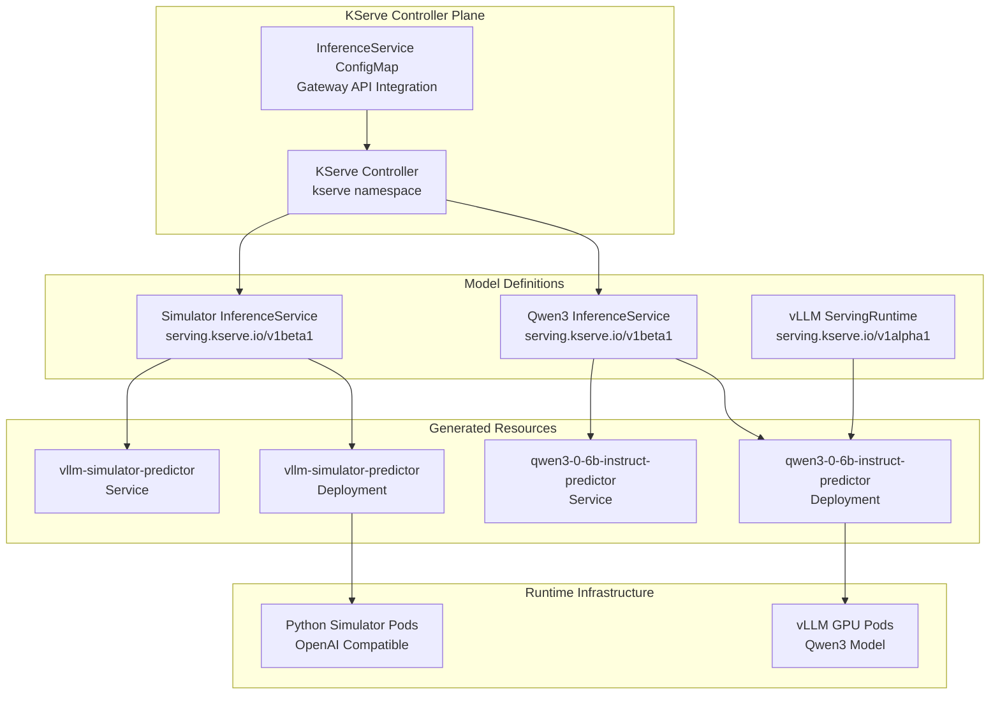

### KServe Configuration

KServe is configured to integrate with the Istio Gateway API through the `inferenceservice-config` ConfigMap:

```yaml
data:
  ingress: |
    {
      "enableGatewayApi": true,
      "kserveIngressGateway": "llm/inference-gateway",
      "ingressDomain": "apps.summit-gpu.octo-emerging.redhataicoe.com"
    }
  deploy: |
    {
      "defaultDeploymentMode": "RawDeployment"
    }
```

**Key Integration Points:**
- **Gateway API Integration**: KServe automatically creates HTTPRoutes for each InferenceService
- **Raw Deployment Mode**: Bypasses KServe's built-in networking for Istio integration
- **Domain-based Routing**: Each model gets a unique subdomain endpoint

### Model Lifecycle Management

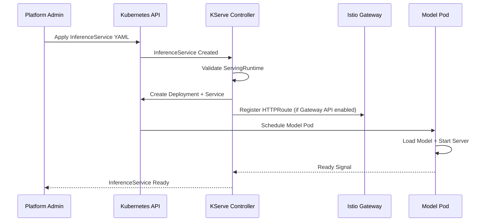

## Multi-Tenant Token Rate Limiting Architecture

### 1. Token Consumption Model

The platform implements consumption-based rate limiting where each API request consumes tokens based on:

- **Prompt tokens**: Input message length
- **Completion tokens**: Generated response length  
- **Model complexity**: Different models have different token costs

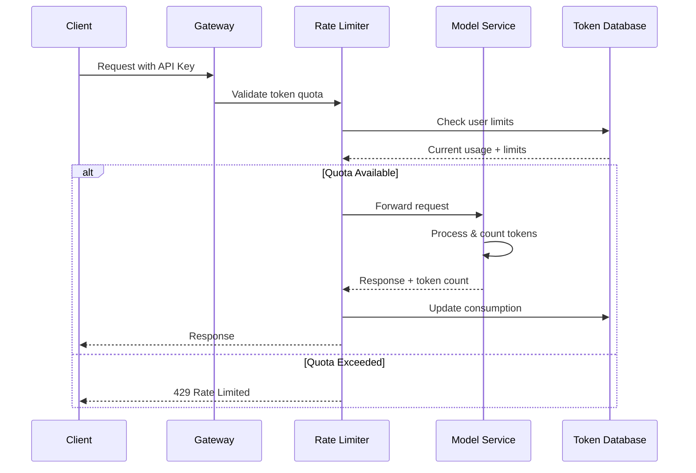

### 2. Multi-Tier Rate Limiting Strategy

```yaml
# Example TokenRateLimitPolicy Configuration
apiVersion: kuadrant.io/v1beta2
kind: TokenRateLimitPolicy
metadata:
  name: user-token-limits
spec:
  targetRef:
    group: gateway.networking.k8s.io
    kind: HTTPRoute
    name: model-routes
  limits:
    "free-tier":
      rates:
      - limit: 10000
        duration: 1h
        unit: token
      when:
      - selector: auth.identity.metadata.annotations.kuadrant\.io/groups
        operator: eq
        value: "free"
    
    "premium-tier":
      rates:
      - limit: 100000
        duration: 1h
        unit: token
      when:
      - selector: auth.identity.metadata.annotations.kuadrant\.io/groups
        operator: eq
        value: "premium"
```

### 3. Dynamic Tier Management

Users can be dynamically assigned to different tiers by updating their secret annotations:

```yaml
apiVersion: v1
kind: Secret
metadata:
  name: apikey-user-abc123
  annotations:
    kuadrant.io/groups: "premium"  # Tier assignment
    maas/monthly-quota: "1000000"  # Custom limits
    maas/daily-quota: "50000"
data:
  api_key: <base64-encoded-key>
```

## Traffic Flow Patterns

### 1. Admin Operations (Key Management)

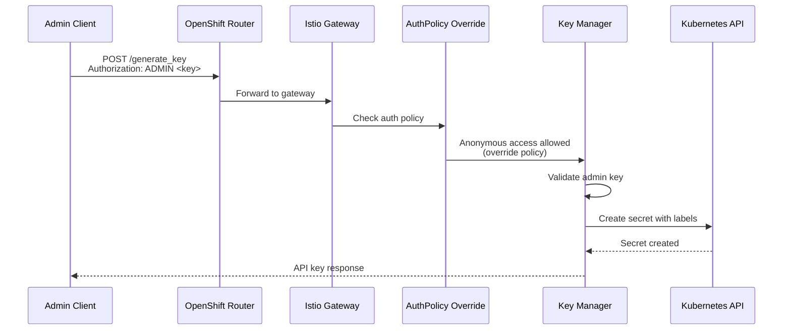

### 2. Model Inference Operations (with KServe)

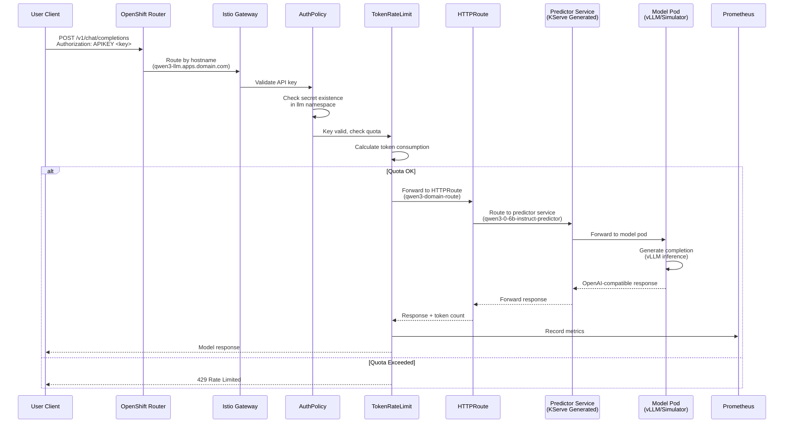

## API Specifications

### Key Manager APIs (Admin)

| Endpoint | Method | Auth | Description |
|----------|--------|------|-------------|
| `/generate_key` | POST | ADMIN | Create new API key for user |
| `/delete_key` | DELETE | ADMIN | Remove existing API key |
| `/v1/models` | GET | ADMIN | List available models |
| `/health` | GET | None | Service health check |

#### Generate Key Request
```json
{
  "user_id": "alice-researcher"
}
```

#### Generate Key Response
```json
{
  "api_key": "abc123...xyz789",
  "user_id": "alice-researcher", 
  "secret_name": "apikey-alice-researcher-f8d92a1b"
}
```

### Model APIs (User) - KServe Generated

| Endpoint | Method | Auth | Description | KServe Service |
|----------|--------|------|-------------|----------------|
| `/v1/chat/completions` | POST | APIKEY/Bearer | OpenAI-compatible completions | Predictor services |
| `/v1/models` | GET | APIKEY/Bearer | List accessible models | Predictor services |
| `/health` | GET | APIKEY/Bearer | Model health check | Predictor services |

**Model-Specific Endpoints:**
- **Qwen3**: `qwen3-llm.apps.summit-gpu.octo-emerging.redhataicoe.com`
- **Simulator**: `simulator-llm.apps.summit-gpu.octo-emerging.redhataicoe.com`

#### Chat Completion Request
```json
{
  "model": "qwen3-0-6b-instruct",
  "messages": [
    {"role": "user", "content": "Explain quantum computing"}
  ],
  "max_tokens": 150
}
```

### KServe InferenceService Specifications

#### GPU Model (Qwen3) InferenceService

```yaml
apiVersion: serving.kserve.io/v1beta1
kind: InferenceService
metadata:
  name: qwen3-0-6b-instruct
  namespace: llm
  annotations:
    serving.kserve.io/deploymentMode: "RawDeployment"
    sidecar.istio.io/inject: "false"
spec:
  predictor:
    serviceAccountName: kserve-service-account
    nodeSelector:
      nvidia.com/gpu.present: "true"
    model:
      modelFormat:
        name: vLLM
      storageUri: hf://Qwen/Qwen3-0.6B
      runtime: vllm-latest
      resources:
        limits:
          nvidia.com/gpu: "1"
          memory: 8Gi
        requests:
          nvidia.com/gpu: "1"
          memory: 4Gi
```

#### Simulator InferenceService

```yaml
apiVersion: serving.kserve.io/v1beta1
kind: InferenceService
metadata:
  name: vllm-simulator
  namespace: llm
  annotations:
    serving.kserve.io/deploymentMode: "RawDeployment"
    sidecar.istio.io/inject: "false"
spec:
  predictor:
    serviceAccountName: kserve-service-account
    containers:
    - name: kserve-container
      image: python:3.11-slim
      ports:
      - containerPort: 8080
      resources:
        limits:
          cpu: 500m
          memory: 512Mi
```

#### vLLM ServingRuntime

```yaml
apiVersion: serving.kserve.io/v1alpha1
kind: ServingRuntime
metadata:
  name: vllm-latest
  namespace: llm
spec:
  containers:
  - name: kserve-container
    image: vllm/vllm-openai:latest
    args:
      - --port=8080
      - --model=/mnt/models
      - --served-model-name={{.Name}}
      - --gpu-memory-utilization=0.8
      - --max-num-seqs=32
  supportedModelFormats:
  - name: vLLM
    autoSelect: true
```

## Security Architecture

### 1. Authentication Flow

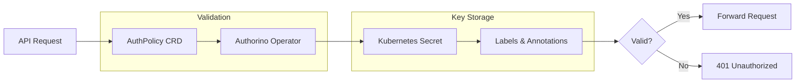

### 2. API Key Lifecycle

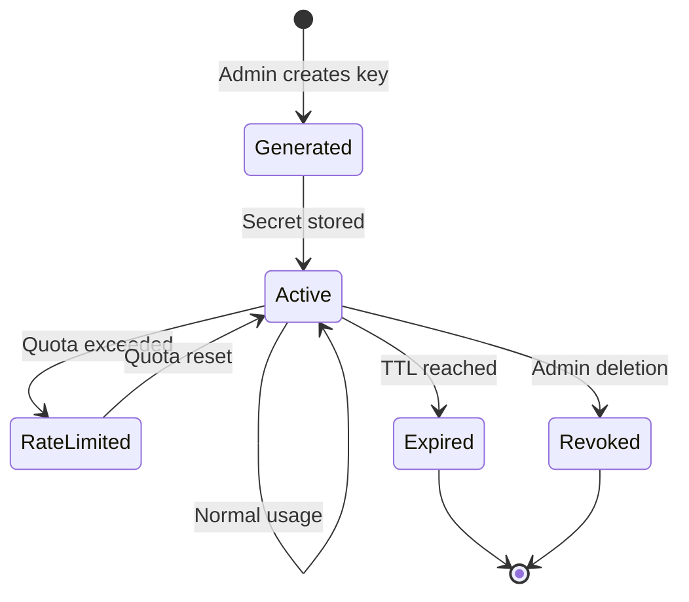

## Scalability Patterns

### 1. Horizontal Pod Autoscaling

```yaml
apiVersion: autoscaling/v2
kind: HorizontalPodAutoscaler
metadata:
  name: key-manager-hpa
spec:
  scaleTargetRef:
    apiVersion: apps/v1
    kind: Deployment
    name: key-manager
  minReplicas: 2
  maxReplicas: 10
  metrics:
  - type: Resource
    resource:
      name: cpu
      target:
        type: Utilization
        averageUtilization: 70
  - type: Resource
    resource:
      name: memory
      target:
        type: Utilization
        averageUtilization: 80
```

### 2. KServe Model Scaling

Each KServe InferenceService can scale independently based on demand:

```yaml
# HPA for KServe-generated deployments
apiVersion: autoscaling/v2
kind: HorizontalPodAutoscaler
metadata:
  name: qwen3-predictor-hpa
  namespace: llm
spec:
  scaleTargetRef:
    apiVersion: apps/v1
    kind: Deployment
    name: qwen3-0-6b-instruct-predictor
  minReplicas: 1
  maxReplicas: 3
  metrics:
  - type: Resource
    resource:
      name: nvidia.com/gpu
      target:
        type: AverageUtilization
        averageUtilization: 80
  - type: Pods
    pods:
      metric:
        name: http_requests_per_second
      target:
        type: AverageValue
        averageValue: "100"
```

**KServe Native Scaling:**
```yaml
# InferenceService with built-in scaling
apiVersion: serving.kserve.io/v1beta1
kind: InferenceService
metadata:
  name: qwen3-0-6b-instruct
spec:
  predictor:
    minReplicas: 1
    maxReplicas: 3
    scaleTarget: 80  # Target GPU utilization percentage
    model:
      # ... model configuration
```

## Token Rate Limiting Implementation

### 1. Policy Configuration Strategy

**Per-User Limits**: Each API key gets individual rate limits based on tier
```yaml
limits:
  "user-specific":
    rates:
    - limit: 50000
      duration: 1h
      unit: token
    when:
    - selector: auth.identity.metadata.labels.maas/user-id
      operator: eq
      value: "alice-researcher"
```

**Tier-Based Limits**: Users grouped by subscription level
```yaml
limits:
  "free-tier":
    rates:
    - limit: 10000
      duration: 24h
      unit: token
  "premium-tier":  
    rates:
    - limit: 1000000
      duration: 24h
      unit: token
```

**Model-Specific Limits**: Different costs for different models
```yaml
limits:
  "gpu-intensive":
    rates:
    - limit: 5000
      duration: 1h
      unit: token
    when:
    - selector: request.url_path
      operator: eq  
      value: "/qwen3-llm/v1/chat/completions"
```

### 2. Token Counting Strategy

```go
type TokenCalculator struct {
    ModelCosts map[string]float64
}

func (tc *TokenCalculator) CalculateTokens(request ChatRequest, response ChatResponse) int {
    promptTokens := tc.countPromptTokens(request.Messages)
    completionTokens := tc.countCompletionTokens(response.Choices)
    
    // Apply model-specific multiplier
    multiplier := tc.ModelCosts[request.Model]
    
    return int((promptTokens + completionTokens) * multiplier)
}
```

### 3. Quota Enforcement Flow

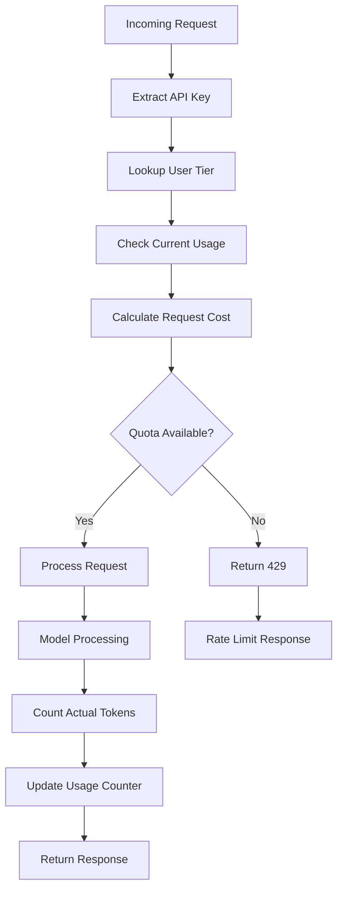

## Monitoring & Observability

### 1. Key Metrics

- **Token consumption per user/tier**
- **Request rate and latency per model**
- **Authentication success/failure rates**
- **Rate limiting triggers**
- **Model utilization and performance**

### 2. Prometheus Configuration

```yaml
apiVersion: v1
kind: ServiceMonitor
metadata:
  name: maas-metrics
spec:
  selector:
    matchLabels:
      app: key-manager
  endpoints:
  - port: metrics
    interval: 30s
    path: /metrics
```

## Deployment Patterns

### 1. Multi-Environment Strategy (with KServe)

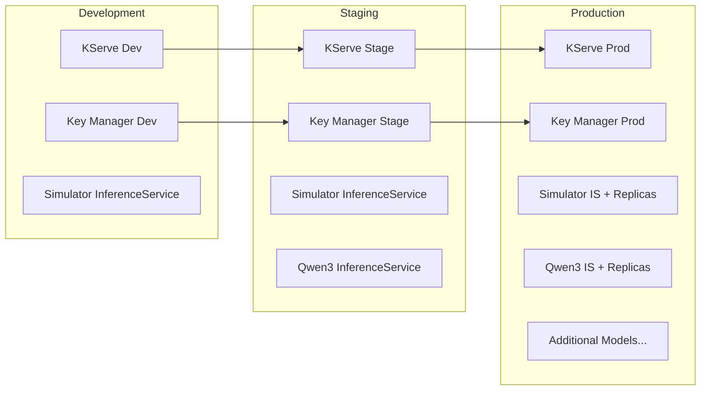

### 2. Blue-Green Deployment

```yaml
# Blue deployment (current)
apiVersion: apps/v1
kind: Deployment
metadata:
  name: key-manager-blue
  labels:
    version: blue
    
# Green deployment (new version)  
apiVersion: apps/v1
kind: Deployment
metadata:
  name: key-manager-green
  labels:
    version: green
```

## Cost Management Architecture

### 1. Token-to-Cost Mapping

```yaml
apiVersion: v1
kind: ConfigMap
metadata:
  name: model-pricing
data:
  pricing.yaml: |
    models:
      qwen3-0-6b-instruct:
        input_cost_per_1k_tokens: 0.002
        output_cost_per_1k_tokens: 0.004
      simulator-model:
        input_cost_per_1k_tokens: 0.001
        output_cost_per_1k_tokens: 0.001
```

### 2. Billing Integration Pattern

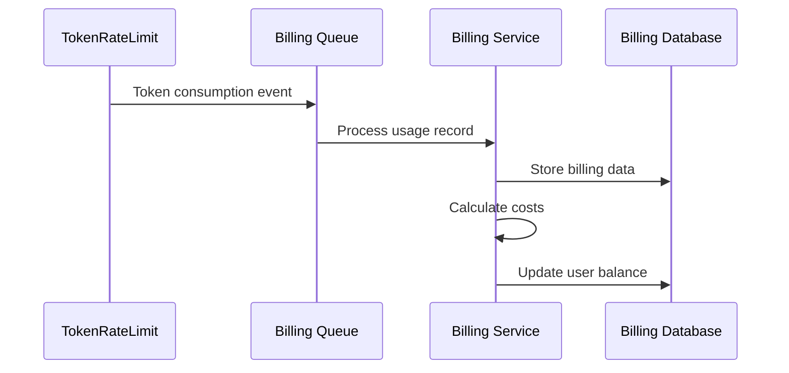

## Token Consumption and Billing Architecture

### 1. Token Consumption Calculation Strategy (TODO: Needs Implementation)

The platform requires real-time token consumption calculation when requests arrive, as tokenization is model-dependent. This is a critical component for accurate billing and quota enforcement.

#### Key Challenges:
- **Model-specific tokenization**: Each model (Qwen3, GPT-4, etc.) uses different tokenizers
- **Real-time calculation**: Tokens must be calculated before request processing for quota enforcement
- **Accuracy vs Performance**: Exact tokenization vs fast approximation tradeoffs
- **Prompt + Completion tracking**: Both input and output tokens need accurate counting

#### Proposed Implementation Options:

**Option 1: Pre-request Token Estimation**
```go
type TokenCalculator interface {
    EstimatePromptTokens(model string, messages []Message) (int, error)
    CalculateCompletionTokens(model string, response string) (int, error)
}

type ModelTokenizer struct {
    ModelCosts map[string]TokenConfig
    Tokenizers map[string]Tokenizer
}

type TokenConfig struct {
    InputMultiplier  float64  // Cost multiplier for input tokens
    OutputMultiplier float64  // Cost multiplier for output tokens
    MaxTokens        int      // Model context limit
}
```

**Option 2: Middleware Token Interception**
```go
func TokenTrackingMiddleware(calculator TokenCalculator) gin.HandlerFunc {
    return func(c *gin.Context) {
        // Extract API key and get user/team info
        apiKey := extractAPIKey(c)
        userInfo := getUserInfo(apiKey)
        
        // Parse request to estimate tokens
        var chatReq ChatCompletionRequest
        c.ShouldBindJSON(&chatReq)
        
        // Estimate prompt tokens
        promptTokens, err := calculator.EstimatePromptTokens(chatReq.Model, chatReq.Messages)
        if err != nil {
            c.JSON(500, gin.H{"error": "Token calculation failed"})
            return
        }
        
        // Check quota before processing
        if !checkQuota(userInfo, promptTokens) {
            c.JSON(429, gin.H{"error": "Token quota exceeded"})
            return
        }
        
        // Process request and track actual tokens
        c.Next()
        
        // Update consumption after response
        updateTokenConsumption(userInfo, promptTokens, completionTokens)
    }
}
```

**Option 3: Model-Aware Proxy Pattern**
```go
type ModelProxy struct {
    ModelEndpoints map[string]ModelEndpoint
    TokenTracker   TokenTracker
}

type ModelEndpoint struct {
    URL           string
    Tokenizer     string
    CostPerToken  float64
}

func (mp *ModelProxy) ProxyRequest(c *gin.Context) {
    // Pre-calculate tokens
    tokens := mp.calculateTokens(request)
    
    // Enforce quota
    if !mp.TokenTracker.CheckQuota(userID, tokens) {
        return quotaExceededResponse()
    }
    
    // Forward to model service
    response := mp.forwardToModel(request)
    
    // Track actual consumption
    actualTokens := mp.extractTokensFromResponse(response)
    mp.TokenTracker.UpdateConsumption(userID, actualTokens)
    
    return response
}
```

#### Integration Points:

1. **Kuadrant TokenRateLimitPolicy Integration**:
   - Custom token counting logic
   - Pre-request quota validation
   - Real-time consumption updates

2. **API Key Secret Updates**:
   - Store consumption in secret annotations
   - Update `maas/spend-current` and `maas/tokens-consumed`
   - Trigger alerts on quota thresholds

3. **Model-Specific Configuration**:
   ```yaml
   apiVersion: v1
   kind: ConfigMap
   metadata:
     name: model-token-config
   data:
     models.yaml: |
       qwen3-0-6b-instruct:
         tokenizer: "qwen"
         input_cost_per_token: 0.000002
         output_cost_per_token: 0.000004
         context_window: 32768
       simulator-model:
         tokenizer: "openai"
         input_cost_per_token: 0.000001
         output_cost_per_token: 0.000001
         context_window: 4096
   ```

### 2. Enhanced V2 API Implementation

Based on the v2 API plan, the platform implements:

#### Team-Scoped Key Management
- **Stateless design**: Teams as label-based groupings
- **Kubernetes-native**: All state in secrets with labels/annotations  
- **Budget tracking**: Real-time spend monitoring per team/user
- **Model access control**: Fine-grained permissions per API key

#### Multi-Tenant Budget Enforcement
```go
type BudgetEnforcer struct {
    UserBudgets map[string]float64
    TeamBudgets map[string]float64
    SpendTracking map[string]float64
}

func (be *BudgetEnforcer) ValidateRequest(userID, teamID string, estimatedCost float64) error {
    userSpend := be.SpendTracking[userID]
    teamSpend := be.SpendTracking[teamID]
    
    if userSpend + estimatedCost > be.UserBudgets[userID] {
        return errors.New("user budget exceeded")
    }
    
    if teamSpend + estimatedCost > be.TeamBudgets[teamID] {
        return errors.New("team budget exceeded")
    }
    
    return nil
}
```

#### Policy-Driven Rate Limiting
```yaml
# Team-specific token limits
apiVersion: kuadrant.io/v1alpha1
kind: TokenRateLimitPolicy
metadata:
  name: team-token-limits
spec:
  limits:
    team-enterprise:
      rates:
        - limit: 1000000
          duration: 24h
          unit: token
      when:
        - selector: auth.identity.metadata.labels.maas/tier
          operator: eq
          value: "enterprise"
    team-free:
      rates:
        - limit: 10000
          duration: 24h
          unit: token
      when:
        - selector: auth.identity.metadata.labels.maas/tier
          operator: eq
          value: "free"
```

## Future Enhancements

### 1. Advanced Rate Limiting

- **Burst allowances**: Temporary quota increases
- **Time-based scaling**: Different limits by time of day
- **Geographic limits**: Region-specific quotas
- **Model-priority queuing**: Premium models for premium users
- **KServe-aware limits**: Rate limiting based on model complexity

### 2. Enhanced KServe Integration

- **Dynamic model deployment**: Auto-deploy models based on demand
- **Model versioning**: A/B testing and canary deployments
- **Multi-model serving**: Single InferenceService serving multiple models
- **Model ensemble**: Combine multiple models for better results
- **Auto-scaling based on queue depth**: Scale models based on pending requests

### 3. Enhanced Security

- **API key rotation**: Automatic key renewal
- **Audit logging**: Comprehensive access logs
- **Anomaly detection**: Unusual usage patterns
- **IP allowlisting**: Geographic restrictions
- **Model access control**: Fine-grained permissions per model

### 4. Performance Optimization

- **Caching layer**: Frequent request caching
- **Connection pooling**: Efficient resource usage
- **Load balancing**: Intelligent request routing
- **Predictive scaling**: ML-based capacity planning
- **KServe optimization**: Model-specific optimization strategies

### 5. Advanced Model Management

- **Model lifecycle management**: Automated model updates and rollbacks
- **Performance monitoring**: Model-specific metrics and alerting
- **Cost optimization**: Automatic model instance sizing
- **Multi-tenant model isolation**: Secure model serving per tenant

### 6. Token Consumption Implementation Priority

1. **Phase 1**: Basic token estimation middleware
2. **Phase 2**: Model-specific tokenizer integration  
3. **Phase 3**: Real-time budget enforcement
4. **Phase 4**: Advanced analytics and cost optimization
5. **Phase 5**: Predictive usage modeling and recommendations

## Comprehensive Workflow Diagrams and Timelines

### Complete Team Management Workflow

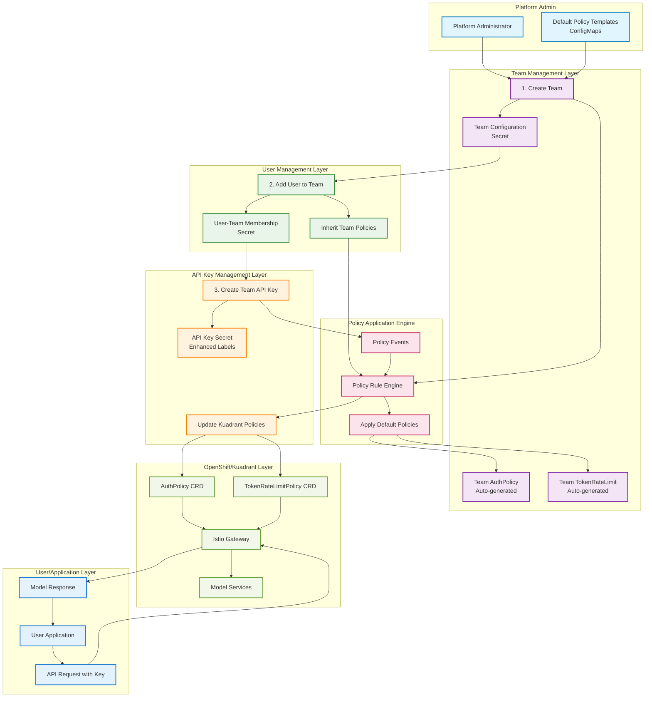

### Detailed Team Creation Sequence

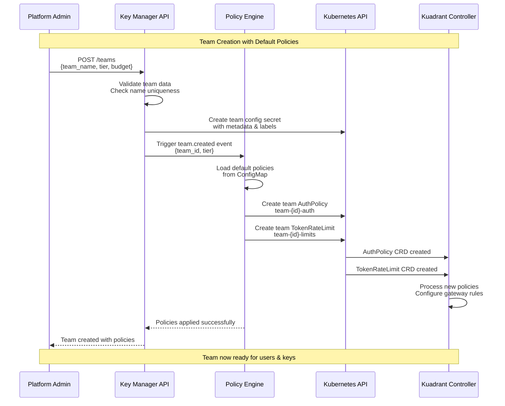

### API Key Creation with Policy Application

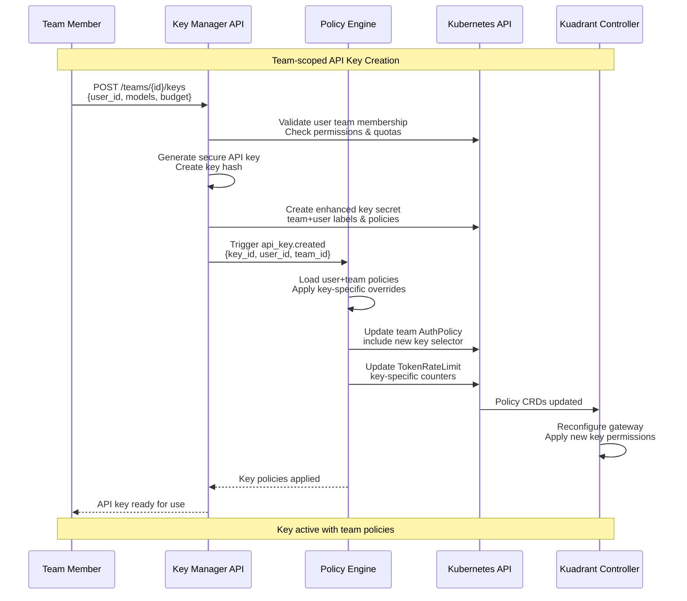

### Workflow Timeline

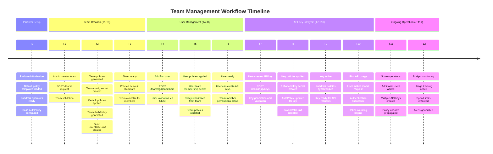

### Policy Inheritance Flow

```mermaid
graph TD
    subgraph "Policy Inheritance Chain"
        PlatformDefaults[Platform Default Policies<br/>ConfigMap]
        TierPolicies[Tier-specific Policies<br/>free/standard/premium]
        TeamPolicies[Team Policies<br/>team-specific overrides]
        UserPolicies[User Policies<br/>role-based + custom budget]
        KeyPolicies[API Key Policies<br/>model access + key budget]
    end
    
    subgraph "Policy Application Rules"
        NewTeamRule[New Team Rule<br/>Apply tier defaults]
        NewUserRule[New User Rule<br/>Inherit team + role]
        NewKeyRule[New Key Rule<br/>User + specific config]
        BudgetRule[Budget Rule<br/>Aggregate team spending]
    end
    
    subgraph "Generated Kuadrant Resources"
        TeamAuth[Team AuthPolicy<br/>team-{id}-auth]
        TeamRate[Team TokenRateLimit<br/>team-{id}-limits]
        GlobalAuth[Global AuthPolicy<br/>all teams aggregated]
        GlobalRate[Global TokenRateLimit<br/>tier-based limits]
    end
    
    PlatformDefaults --> TierPolicies
    TierPolicies --> TeamPolicies
    TeamPolicies --> UserPolicies
    UserPolicies --> KeyPolicies
    
    NewTeamRule --> TeamPolicies
    NewUserRule --> UserPolicies
    NewKeyRule --> KeyPolicies
    BudgetRule --> TeamPolicies
    
    TeamPolicies --> TeamAuth
    TeamPolicies --> TeamRate
    UserPolicies --> GlobalAuth
    KeyPolicies --> GlobalRate
    
    %% Styling
    classDef policyClass fill:#e8f5e8,stroke:#388e3c,stroke-width:2px
    classDef ruleClass fill:#fff3e0,stroke:#f57c00,stroke-width:2px
    classDef resourceClass fill:#e3f2fd,stroke:#1976d2,stroke-width:2px
    
    class PlatformDefaults,TierPolicies,TeamPolicies,UserPolicies,KeyPolicies policyClass
    class NewTeamRule,NewUserRule,NewKeyRule,BudgetRule ruleClass
    class TeamAuth,TeamRate,GlobalAuth,GlobalRate resourceClass
```

## Deployment and Operations (Consolidated Guide)

### Current Implementation Status

The platform now supports:
- **Enhanced Team Management**: V2 API with stateless, Kubernetes-native team and user management
- **Policy Engine Integration**: Automatic Kuadrant policy creation and management
- **Multi-Tier Budget Control**: Free, standard, and premium tiers with configurable limits
- **Enhanced API Key Management**: Team-scoped keys with rich metadata and budget tracking

### Deployment Configuration

#### Required Environment Variables
```bash
# Core Configuration
export KEY_NAMESPACE="llm"
export SECRET_SELECTOR_LABEL="kuadrant.io/apikeys-by"
export SECRET_SELECTOR_VALUE="rhcl-keys"
export DISCOVERY_ROUTE="inference-route"

# Enhanced Features
export ENABLE_POLICY_MANAGEMENT="true"
export GATEWAY_NAME="inference-gateway"
export GATEWAY_NAMESPACE="llm"
export POLICY_TEMPLATE_CONFIGMAP="platform-default-policies"
export SERVICE_NAME="key-manager"  # Consider: "maas-platform-manager"
export ADMIN_API_KEY="secure-admin-key"
```

#### Policy Template Configuration
```yaml
apiVersion: v1
kind: ConfigMap
metadata:
  name: platform-default-policies
  namespace: llm
data:
  tier-free-policy.yaml: |
    tier: "free"
    token_limit_per_hour: 10000
    token_limit_per_day: 50000
    budget_usd_monthly: 100.0
    models_allowed: ["simulator-model"]
    max_concurrent_requests: 5
    enable_budget_enforcement: true
  tier-standard-policy.yaml: |
    tier: "standard"
    token_limit_per_hour: 50000
    token_limit_per_day: 500000
    budget_usd_monthly: 1000.0
    models_allowed: ["simulator-model", "qwen3-0-6b-instruct"]
    max_concurrent_requests: 10
  tier-premium-policy.yaml: |
    tier: "premium"
    token_limit_per_hour: 200000
    token_limit_per_day: 2000000
    budget_usd_monthly: 5000.0
    models_allowed: ["simulator-model", "qwen3-0-6b-instruct", "premium-models"]
    max_concurrent_requests: 25
```

### Enhanced V2 API Endpoints

The platform implements a comprehensive API covering:

#### Team Management
- `POST /v2/teams` - Create team with tier and budget defaults
- `GET /v2/teams/{id}` - Get team details, members, and keys
- `DELETE /v2/teams/{id}` - Remove team and cleanup all resources

#### User Management  
- `POST /v2/teams/{id}/members` - Add user to team with role and budget
- `GET /v2/teams/{id}/members` - List team members
- `DELETE /v2/teams/{id}/members/{user}` - Remove user from team

#### Enhanced Key Management
- `POST /v2/teams/{id}/keys` - Create team-scoped API key with budget/model limits
- `GET /v2/teams/{id}/keys` - List team keys with usage/spend information
- `PATCH /v2/keys/{id}` - Update key budget/status/models
- `DELETE /v2/keys/{id}` - Remove key and update policies

#### Policy & Admin Management
- `GET /v2/teams/{id}/policies` - View applied team policies
- `POST /v2/teams/{id}/policies/sync` - Re-sync team policies with defaults
- `POST /v2/teams/{id}/policies/validate` - Validate policy configuration
- `GET /v2/admin/policies/health` - Policy system health check
- `GET /v2/admin/policies/compliance` - Team compliance report

#### Activity & Usage
- `GET /v2/teams/{id}/activity` - Team activity and spending summary
- `GET /v2/teams/{id}/usage` - Detailed usage breakdown by user/model

### Operational Procedures

#### Team Workflow Example
```bash
# 1. Create team
curl -X POST /v2/teams \
  -H "Authorization: ADMIN $ADMIN_KEY" \
  -d '{"team_id":"data-science","team_name":"Data Science Team","default_tier":"standard","default_budget_usd":1000}'

# 2. Add team member  
curl -X POST /v2/teams/data-science/members \
  -H "Authorization: ADMIN $ADMIN_KEY" \
  -d '{"user_email":"alice@company.com","role":"member","custom_budget_usd":500}'

# 3. Create team API key
curl -X POST /v2/teams/data-science/keys \
  -H "Authorization: ADMIN $ADMIN_KEY" \
  -d '{"user_id":"alice","alias":"research-key","models":["qwen3-0-6b-instruct"],"budget_usd":200}'

# 4. Validate policies applied
curl -X POST /v2/teams/data-science/policies/validate \
  -H "Authorization: ADMIN $ADMIN_KEY" \
  -d '{}'
```

#### Monitoring Key Metrics
- Team creation/deletion rates
- API key usage and spend rates  
- Policy application success rates
- Budget compliance percentages
- Token consumption patterns per tier

#### Troubleshooting Common Issues

**Policy Templates Not Loading**:
```bash
kubectl get configmap platform-default-policies -n llm
kubectl logs -n platform-services deployment/key-manager | grep -i policy
```

**Team Creation Fails**:
```bash
kubectl auth can-i create authpolicies.kuadrant.io --as=system:serviceaccount:platform-services:key-manager
kubectl get pods -n kuadrant-system
```

**Budget/Token Tracking Issues**:
```bash
kubectl get secrets -n llm -l maas/resource-type=team-key
kubectl describe secret <key-secret-name> -n llm
```

### Migration Path

**From Legacy to Enhanced**:
1. Deploy enhanced version alongside legacy (different service name)
2. Create default team for existing users
3. Migrate existing API keys to team context
4. Switch traffic to enhanced service
5. Validate all functionality works correctly

### Security Considerations

- Admin API key rotation policy
- RBAC follows least privilege principle  
- Enhanced secret metadata for audit trails
- Team membership stored securely in Kubernetes
- Policy management requires elevated permissions