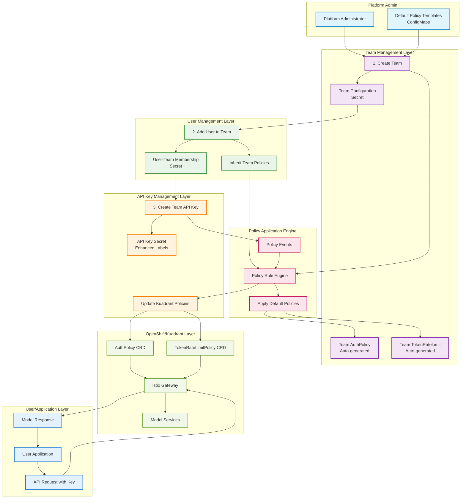
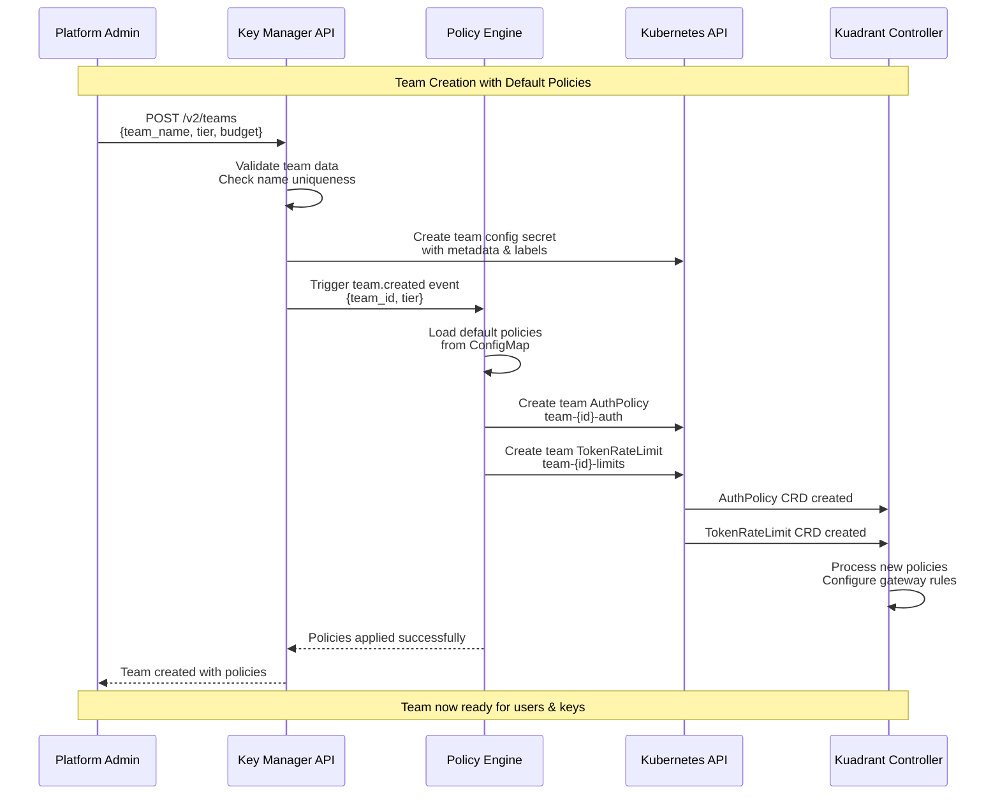
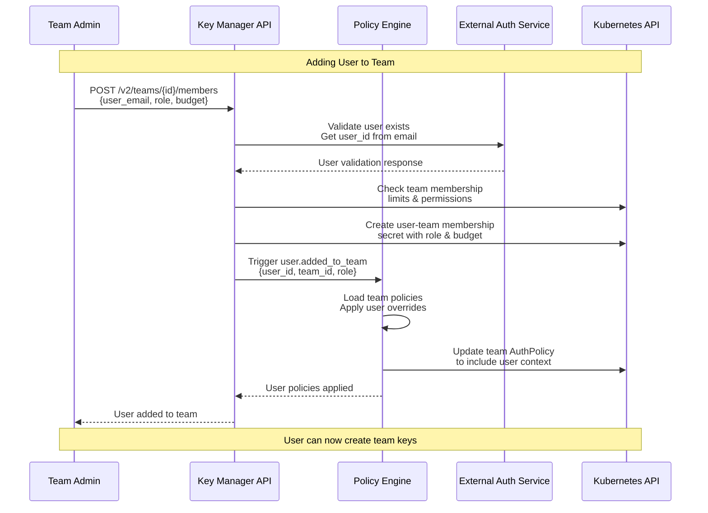
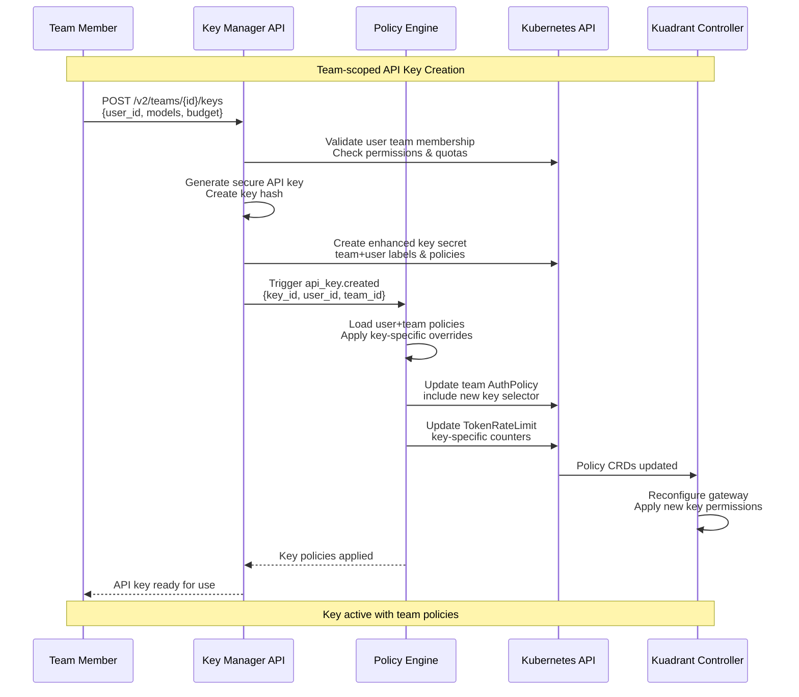

# Team Management Workflow Visualization

## Complete Workflow Overview



## Detailed Team Creation Workflow



## User Addition to Team Workflow



## API Key Creation with Policy Application



## Policy Inheritance and Application Flow

```mermaid
graph TD
    subgraph "Policy Inheritance Chain"
        PlatformDefaults[Platform Default Policies<br/>ConfigMap]
        TierPolicies[Tier-specific Policies<br/>free/standard/premium]
        TeamPolicies[Team Policies<br/>team-specific overrides]
        UserPolicies[User Policies<br/>role-based + custom budget]
        KeyPolicies[API Key Policies<br/>model access + key budget]
    end
    
    subgraph "Policy Application Rules"
        NewTeamRule[New Team Rule<br/>Apply tier defaults]
        NewUserRule[New User Rule<br/>Inherit team + role]
        NewKeyRule[New Key Rule<br/>User + specific config]
        BudgetRule[Budget Rule<br/>Aggregate team spending]
    end
    
    subgraph "Generated Kuadrant Resources"
        TeamAuth[Team AuthPolicy<br/>team-{id}-auth]
        TeamRate[Team TokenRateLimit<br/>team-{id}-limits]
        GlobalAuth[Global AuthPolicy<br/>all teams aggregated]
        GlobalRate[Global TokenRateLimit<br/>tier-based limits]
    end
    
    PlatformDefaults --> TierPolicies
    TierPolicies --> TeamPolicies
    TeamPolicies --> UserPolicies
    UserPolicies --> KeyPolicies
    
    NewTeamRule --> TeamPolicies
    NewUserRule --> UserPolicies
    NewKeyRule --> KeyPolicies
    BudgetRule --> TeamPolicies
    
    TeamPolicies --> TeamAuth
    TeamPolicies --> TeamRate
    UserPolicies --> GlobalAuth
    KeyPolicies --> GlobalRate
    
    %% Styling
    classDef policyClass fill:#e8f5e8,stroke:#388e3c,stroke-width:2px
    classDef ruleClass fill:#fff3e0,stroke:#f57c00,stroke-width:2px
    classDef resourceClass fill:#e3f2fd,stroke:#1976d2,stroke-width:2px
    
    class PlatformDefaults,TierPolicies,TeamPolicies,UserPolicies,KeyPolicies policyClass
    class NewTeamRule,NewUserRule,NewKeyRule,BudgetRule ruleClass
    class TeamAuth,TeamRate,GlobalAuth,GlobalRate resourceClass
```