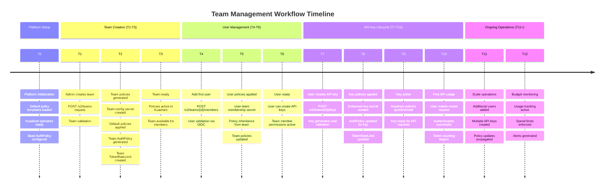
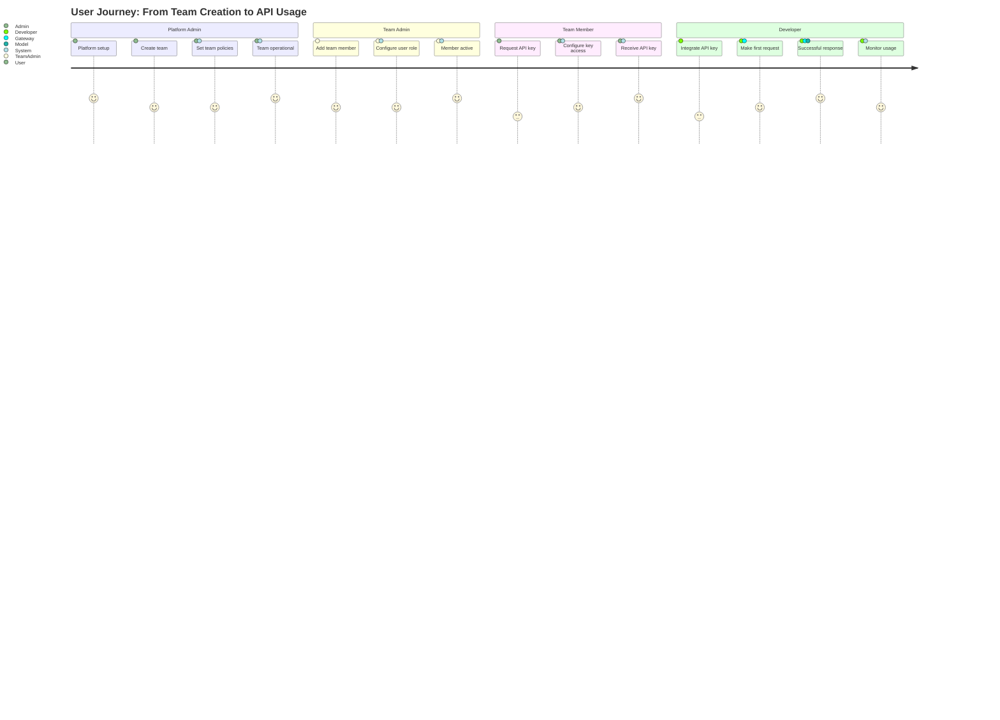
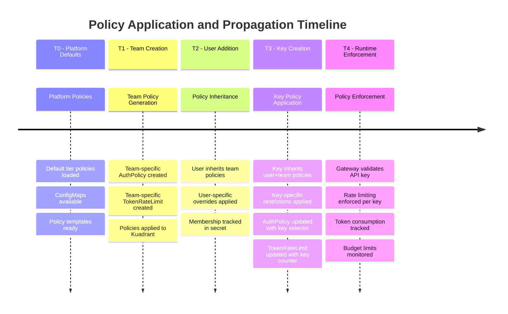
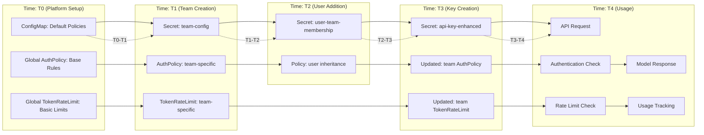

# Workflow Timeline and Sequence Documentation

## Complete Workflow Timeline

## Detailed Event Sequence Timeline

```mermaid
gantt
    title Team Workflow Implementation Timeline
    dateFormat X
    axisFormat %s
    
    section Platform Setup
    Load default policies        :milestone, m1, 0, 0
    Kuadrant ready              :milestone, m2, 1, 1
    
    section Team Creation
    Validate team request       :active, t1, 2, 5
    Create team config          :t2, 5, 8
    Generate team AuthPolicy    :t3, 8, 12
    Generate TokenRateLimit     :t4, 8, 12
    Apply to Kuadrant          :t5, 12, 15
    Team ready                 :milestone, m3, 15, 15
    
    section User Addition
    Validate user              :u1, 16, 18
    Create membership secret   :u2, 18, 20
    Update team policies       :u3, 20, 23
    User ready                :milestone, m4, 23, 23
    
    section API Key Creation
    Generate API key           :k1, 24, 26
    Create enhanced secret     :k2, 26, 28
    Update AuthPolicy          :k3, 28, 31
    Update TokenRateLimit      :k4, 28, 31
    Sync to gateway           :k5, 31, 34
    Key active               :milestone, m5, 34, 34
    
    section First Usage
    API request received      :r1, 35, 36
    Authentication check      :r2, 36, 37
    Rate limit check         :r3, 37, 38
    Forward to model         :r4, 38, 40
    Response & tracking      :r5, 40, 42
    
    section Scaling
    Add more users           :s1, 43, 50
    Create more keys         :s2, 45, 55
    Monitor usage           :s3, 50, 60
```

## Event-Driven Timeline with Dependencies

## Policy Application Timeline

## Resource Creation Timeline

## Critical Path Analysis

```mermaid
graph TD
    Start([Start: Platform Ready])
    
    subgraph "Critical Path: Team Setup"
        A[Create Team Request]
        B[Generate Team Policies]
        C[Apply to Kuadrant]
        D{Policies Active?}
        E[Team Ready]
    end
    
    subgraph "Critical Path: User Setup"  
        F[Add User Request]
        G[Create Membership]
        H[Apply User Policies]
        I{User Policies Active?}
        J[User Ready]
    end
    
    subgraph "Critical Path: Key Setup"
        K[Create Key Request]
        L[Generate API Key]
        M[Update Policies]
        N{Key Policies Active?}
        O[Key Ready]
    end
    
    subgraph "Critical Path: Usage"
        P[API Request]
        Q[Auth Check]
        R[Rate Check]
        S[Forward to Model]
        T[Response]
    end
    
    Start --> A
    A --> B
    B --> C
    C --> D
    D -->|Yes| E
    D -->|No| B
    
    E --> F
    F --> G
    G --> H
    H --> I
    I -->|Yes| J
    I -->|No| H
    
    J --> K
    K --> L
    L --> M
    M --> N
    N -->|Yes| O
    N -->|No| M
    
    O --> P
    P --> Q
    Q --> R
    R --> S
    S --> T
    
    %% Critical path styling
    classDef critical fill:#ffcdd2,stroke:#d32f2f,stroke-width:3px
    classDef ready fill:#c8e6c9,stroke:#388e3c,stroke-width:2px
    classDef check fill:#fff3e0,stroke:#f57c00,stroke-width:2px
    
    class A,B,C,F,G,H,K,L,M,P critical
    class E,J,O ready
    class D,I,N,Q,R check
```

